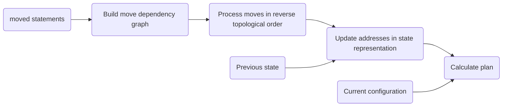
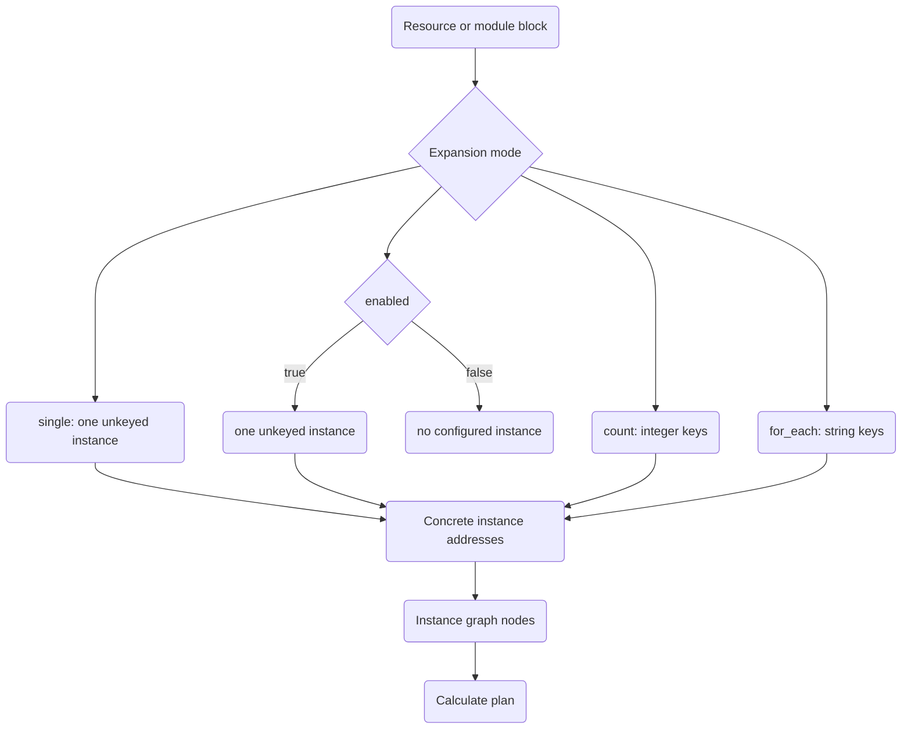
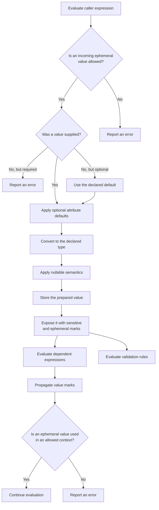
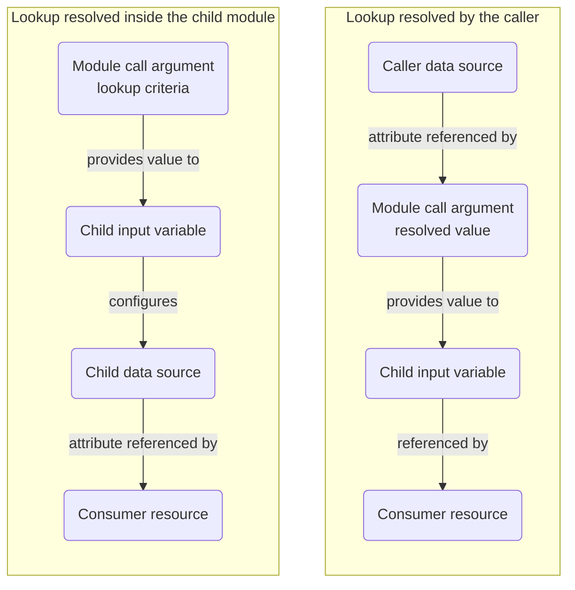

<!--
Proponowany scope artykułu
1. Problem
Nie wystarczy mieć IaC. Trzeba mieć:
moduły, które da się ponownie używać,
sensowny sposób ich publikacji,
i dystrybucję, która nie rozsypuje się organizacyjnie.
2. Cechy dobrego modułu
Tu wchodzą:
jasno określony kontrakt wejścia/wyjścia,
examples,
docs generation,
versioning,
testowalność,
unikanie nadmiernej logiki lookupów.
Tu bardzo mocno pasuje Twoje:
var + validation zamiast data lookups w module
To jest świetny podpunkt z własną argumentacją.
3. Kiedy własny moduł, a kiedy gotowy
To będzie jeden z najcenniejszych fragmentów.
 Na przykład:
najpierw AVM / gotowy moduł,
własny moduł tylko gdy brakuje sensownej abstrakcji,
unikać „wrapper hell”.
4. Struktura repo modułu
Tu:
examples/
docs generation
tests
template repo
local testing
gha/taskfile
5. Wersjonowanie i publikacja
Tu:
semver
release workflow
internal publishing
discovery/adoption
6. Lightweight internal registry
Tu:
dostępne opcje
dlaczego własne lekkie registry ma sens
Twój przykład: Azure Functions + Storage Account + AAD auth
ewentualnie mirrorowanie jako reliability/control story
7. Podsumowanie
Wniosek:
reusable modules without distribution are not enough,
registry without module discipline is not enough,
oba razem tworzą sensowny model organizacyjny.
-->

Breaking down infrastructure as code and extracting shared patterns into modules is not enough. Just as critical are: structure (contracts, tests, documentation), versioning and publishing (why a registry matters), and adoption without organizational friction.

While working with different clients, I've seen repositories with "modules" that were just wrappers without meaningful abstraction, or where modules were managed like regular resources. That is: no versioning, no tests, no conventions, and no publishing chain. As a result, teams wasted time explaining what a module does, how to update it, and when they could even use it.

Here I'll show you the concrete pattern I use: how to design modules that are truly flexible, and how to set up a lightweight registry that doesn't become additional operational burden.

For readers interested in the internals, collapsible **"Deep dive"** callouts connect selected behaviors to their implementation in the [OpenTofu 1.12](https://opentofu.org/blog/opentofu-1-12-0/) source code.


This article is part of the **"Infrastructure at Scale with Azure and OpenTofu"** series. The full series includes:

- [x] [Azure IaC built for your needs](../2025-09-26-azure-iac-built-for-your-needs/)

  Explore multiple patterns for organizing Infrastructure as Code — their strengths, tradeoffs, and when to use which.
  I'll walk you through a proven skeleton that you can adapt in your org or team.

- [ ] [**Truly reusable IaC modules**](#) (you're reading this one now)

  Learn how to design [OpenTofu](https://opentofu.org/) modules with stable APIs, predictable resource identity, practical testing, and safe versioning.
  I'll also show you how to build a lightweight module registry you can host anywhere.

- [ ] Secure CI/CD for OpenTofu

  See how a solid CI/CD pipeline can streamline your infrastructure development.
  We'll cover tools, automation, and proven patterns to help your code ship faster and safer.



## Assumptions

In this article, I'm building on the foundation from the [first part](../2025-09-26-azure-iac-built-for-your-needs/) of this series.

I'll be using:

* Selected [Azure Verified Modules (AVM)](https://azure.github.io/Azure-Verified-Modules/) conventions and modules where their common language and provider surface is compatible with OpenTofu. [The AVM project officially supports Bicep and Terraform, but not OpenTofu](https://github.com/Azure/Azure-Verified-Modules/discussions/1512), so these examples demonstrate practical compatibility rather than support tested or guaranteed by AVM.
* My own modules and `tofu-registry` implementation where AVM does not provide a suitable abstraction or an example relies on OpenTofu-specific features. The registry will also demonstrate how to build a production-ready, secure, and cost-effective solution without introducing unnecessary operational complexity.

---

## Naming convention

Adding modules to your organization seems easy at first. You create a new repository or directory in your modules monorepo, write some code, deploy, and voilà everything works in production. But time flies. New people join your team, some initial creators leave, and suddenly your modules catalog becomes a mess. That's why it's critical to **establish** a good naming convention early, capture it in an ADR, and automate enforcement of it.


One of the things that I appreciate in AVM is their naming convention. Take a look at [it](https://azure.github.io/Azure-Verified-Modules/indexes/terraform/). It categorizes modules into three types: resource, pattern, utility.

It is immediately clear from the module name whether it creates resources, is a pattern, or a utility.

<!--

TODO: 
In my internal registry, I follow the same approach:
- `avm-res-storage-storageaccount` - **resource**: creates a single Azure Storage Account
- `avm-pat-app-authentication` - **pattern**: orchestrates Azure Functions, Key Vault, and managed identity
- `avm-utl-naming` - **utility**: helpers for consistent naming across modules

-->


When the same abstraction has implementations for different cloud providers, the module name should identify the provider explicitly. I use the provider's local name rather then inventing another abbreviation, for example `aws`, `azurerm` or `google`.

---

## Repository template

When using repository per module pattern, another good idea is to have a repository template which allows to create modules in a repeatable way. It saves bootstrapping time and makes it easy to switch between different repositories, since the structure is standardized.

A good template repository should include:

* Directory structure: `examples`, `tests` as well as minimal tf files: `locals.tf`, `main.tf`, `outputs.tf`, `terraform.tf`, `variables.tf`.
* CI/CD scaffolding: more in the next article in this series.
* Dependency upgrade manager config: more in the next article in this series.
* `README.md` files for the root module and each example.
* `AGENTS.md` for those who use AI agent support to write or generate code.
* `CHANGELOG.md` for those who prefer not to rely on GitHub releases.

---

## Reusable by design

Before diving into the code, there are several distinguishing characteristics that make a module truly reusable.

Examples are part of a module's public interface. A consumer should be able to find the smallest useful configuration, understand its assumptions, and apply it without reconstructing the required setup. The `default` example from [terraform-azurerm-avm-res-keyvault-vault (v0.10.2)](https://github.com/Azure/terraform-azurerm-avm-res-keyvault-vault/tree/v0.10.2/examples/default) demonstrates this well through a concise README and an end-to-end Terraform configuration.

The root module and each example have their own README generated with [terraform-docs](https://terraform-docs.io/). In the `default` example, the generated documentation includes the complete calling configuration together with its provider requirements, inputs, outputs, and module dependencies.

Generating documentation from the same configuration reduces manual duplication and keeps the example's reference material synchronized with its source. It does not, however, prove that the configuration can be initialized, planned, or applied. The examples become executable contracts only when they are verified as part of the strategy described later in [Testing](#testing).

Good examples should be:

- [x] Focused on one use case
- [x] Readable and well documented
- [x] Ready to initialize, plan, and apply

Another critical characteristic is the migration path between module versions. A good IaC module should include:

- [x] Release notes
- [x] Breaking changes
- [x] Migration path (upgrade + rollback)

The release notes of [terraform-azurerm-avm-res-network-privatednszone (v0.4.0)](https://github.com/Azure/terraform-azurerm-avm-res-network-privatednszone/releases/tag/v0.4.0) demonstrate this well. They clearly document all three items, which I find essential. With this information, planning migrations becomes straightforward, and you can create [OpenRewrite](https://docs.openrewrite.org/) recipes or build custom automation.


Planning the migration path is one thing. Executing it deterministically across many repositories is another. In my previous article, [Refactoring HCL organization-wide with OpenRewrite](../2026-04-23-refactoring-hcl-organization-wide-with-openrewrite/), I showed how to approach infrastructure-as-code refactoring in a repeatable, auditable way using [OpenRewrite](https://docs.openrewrite.org/) recipes.

If you're working with multiple module repositories or coordinating migrations across teams, that approach transforms ad hoc scripts into controlled processes that land as clean pull requests.


Reusability should be demonstrated, not merely claimed. Tests document expected behavior, expose breaking changes before release, and give consumers evidence that the module can evolve without destabilizing their deployments. The [Testing](#testing) section shows how to build that evidence incrementally, from fast contract checks to executable examples and real deployments.

These signals give consumers confidence to adopt a module. Its implementation must uphold that promise: the module should remain focused, make its dependencies explicit, and offer flexibility without attempting to support every possible configuration.

---

## Implementation

There is no universal measure of how configurable a module should be. Too few options make it little more than a rigid wrapper; too many turn its interface into another provider schema that is harder to understand and maintain than the resources underneath it.

The goal is to expose the decisions consumers genuinely need to make while keeping the module's responsibility and contract clear.

A module should represent an intentional abstraction, not merely relocate resource declarations into another repository. The [Azure Well-Architected Framework](https://learn.microsoft.com/en-us/azure/well-architected/operational-excellence/infrastructure-as-code-design) recommends using modules to encapsulate complex configurations or meaningful combinations of resources, while avoiding unnecessary abstraction when a resource's default configuration is already sufficient.

### Organize resources by responsibility

Once the module's responsibility is clear, its resource graph should make that responsibility easy to recognize.

[OpenTofu](https://opentofu.org/) evaluates all configuration files in a module as a single configuration. Splitting resources across files does not affect dependency resolution or deployment order. That separation exists entirely for the benefit of readers and maintainers.

For small modules, keeping resources together in `main.tf` is often the most readable option. As a module grows, however, a single file can obscure the architecture it is supposed to express. At that point, I split the configuration by responsibility, using consistent file names across provider-specific implementations wherever the underlying concepts align, for example `main-compute.tf`, `main-database.tf`, `main-dns.tf`, `main-object-storage.tf`.

### Preserve resource identity across changes

OpenTofu associates every managed object in its state with a resource address. Within a module, that address consists of the resource type and its local name. The calling configuration prefixes it with the path of the module instance, for example: `module.tofu_registry.azurerm_storage_account.registry`.

File names are not part of a resource address. Moving a resource block from `main.tf` to `main-object-storage.tf` changes only the organization of the source code. Renaming the block itself, however, changes its address and can cause OpenTofu to plan the destruction of the object at the old address and the creation of another at the new one.

The `count` and `for_each` meta-arguments extend resource addresses with instance keys and introduce additional identity considerations. They are discussed separately in the next section.

#### Rename a resource without replacing it

Suppose an earlier version of the module declared its storage account as follows.

**`main-object-storage.tf`:**

```hcl
resource "azurerm_storage_account" "artifacts" {
  /* Remaining code omitted for clarity */
}
```

A later version might use a name that better describes the resource's role.

**`main-object-storage.tf`:**

```hcl
resource "azurerm_storage_account" "registry" {
  /* Remaining code omitted for clarity */
}
```

Without an explicit migration, the old and new addresses are unrelated from OpenTofu's perspective. A `moved` block records that both addresses represent the same managed object:

**`moved.tf`:**

```hcl
moved {
  from = azurerm_storage_account.artifacts
  to   = azurerm_storage_account.registry
}
```

When a consumer upgrades the module, OpenTofu associates the existing state object with the new address before calculating the remaining changes. The migration travels with the module and does not require consumers to run `tofu state mv` in every workspace.

#### Move a resource to a child module

The same mechanism supports more advanced refactorings, including moving a resource into a local child module distributed as part of the same module package.

**`modules/storage/main.tf`:**

```hcl
resource "azurerm_storage_account" "registry" {
  /* Remaining code omitted for clarity */
}
```

**`main-object-storage.tf`:**

```hcl
module "storage" {
  source = "./modules/storage"

  /* Remaining code omitted for clarity */
}
```

**`moved.tf`:**

```hcl
moved {
  from = azurerm_storage_account.registry
  to   = module.storage.azurerm_storage_account.registry
}
```

When a consumer upgrades, OpenTofu associates the existing state object with the resource inside the child module instead of planning to recreate it. This pattern is appropriate when the parent and child modules are maintained and distributed together.

However, a module can declare moves only for its own objects and objects in its child modules. It cannot rewrite addresses belonging to its caller or an unrelated module.

#### Preserve upgrade paths across multiple renames

Consumers of a truly reusable module do not necessarily install every release. One deployment might upgrade from the immediately preceding version, while another might skip several versions.

Suppose the same resource had the following names over its lifetime:

1. `azurerm_storage_account.storage`
2. `azurerm_storage_account.artifacts`
3. `azurerm_storage_account.registry`

Preserve the complete history as a chain of migrations:

**`moved.tf`:**

```hcl
moved {
  from = azurerm_storage_account.storage
  to   = azurerm_storage_account.artifacts
}

moved {
  from = azurerm_storage_account.artifacts
  to   = azurerm_storage_account.registry
}
```

This allows consumers using either historical address to upgrade directly to the current module version. Removing an old `moved` block can therefore be a breaking change, even when all consumers of the most recent release have already applied the newer address.


A provider-assigned ID identifies the remote object in the provider's API, while a resource address identifies where OpenTofu manages that object in its state. A `moved` block changes the latter association. It does not rename or otherwise modify the remote object.

Before calculating the plan, OpenTofu's `ApplyMoves` function rewrites the in-memory state representation. It builds a dependency graph for chained and nested moves and processes the statements in reverse topological order.



This is why a consumer can upgrade across several historical addresses in a single operation.

It is important to remember that a successful address migration does not guarantee that OpenTofu will preserve the remote object. After applying the move to the state representation, OpenTofu still compares the resource configuration with the remote object. Changes to arguments that require replacement remain visible in the resulting plan.

For more information, see the OpenTofu implementation of [ApplyMoves](https://github.com/opentofu/opentofu/blob/v1.12.0/internal/refactoring/move_execute.go#L18-L193) and the official documentation for [refactoring modules](https://opentofu.org/docs/v1.12/language/modules/develop/refactoring/).


Before publishing a refactoring release, test the upgrade against state created with an earlier supported module version. The resulting plan should show the address migration without any unexpected destroy-and-create actions.

### Use `enabled`, `count`, and `for_each` deliberately

Optional behavior is sometimes necessary, but every conditional branch multiplies the number of module configurations that must be understood, tested, and supported.

The `enabled`, `count`, and `for_each` meta-arguments do more than reduce repetition. They determine whether a resource has no instance key, an integer key, or a string key. Choosing between them is therefore a decision about resource identity, not merely syntax:

- Use [`enabled`](https://opentofu.org/docs/v1.12/language/meta-arguments/enabled/) for an optional singleton.
- Use [`count`](https://opentofu.org/docs/v1.12/language/meta-arguments/count/) when an ordinal position is the intended identity.
- Use [`for_each`](https://opentofu.org/docs/v1.12/language/meta-arguments/for_each/) when every instance has a stable, meaningful key.

#### Model an optional singleton with `enabled`

OpenTofu provides the `enabled` lifecycle meta-argument for a resource or module that may have either zero or one instance. Unlike the traditional `count = condition ? 1 : 0` pattern, it preserves the unkeyed resource address and does not force consumers to access an otherwise singular resource through `[0]`.

**`variables.tf`:**

```hcl
variable "create_dns_record" {
  description = "Whether to create a private DNS record for the registry."
  type        = bool
  default     = true
}
```

**`main-dns.tf`:**

```hcl
resource "azurerm_private_dns_cname_record" "this" {
  name                = var.dns_record_name
  zone_name           = var.private_dns_zone_name
  resource_group_name = azurerm_resource_group.this.name
  ttl                 = 300
  record              = azurerm_storage_account.registry.primary_blob_host

  lifecycle {
    enabled = var.create_dns_record
  }
}
```

**`outputs.tf`:**

```hcl
output "dns_record_fqdn" {
  description = "The FQDN of the registry DNS record, or null when it is disabled."
  value = (
    azurerm_private_dns_cname_record.this != null
    ? azurerm_private_dns_cname_record.this.fqdn
    : null
  )
}
```

When disabled, the resource evaluates to `null`. Consumers can therefore reason about an optional object directly rather than treating it as a collection that happens to contain at most one element.

The `enabled` meta-argument was introduced in [OpenTofu 1.11.0](https://opentofu.org/docs/v1.11/language/meta-arguments/enabled/). Using it makes that minimum OpenTofu version part of the module contract and should be reflected in its version constraint.

#### Use `count` only when position is identity

The `count` meta-argument is appropriate for a homogeneous, numbered pool where instances are intentionally identified by their ordinal position.

For example, a module can create a configurable number of outbound public IP addresses.

**`variables.tf`:**

```hcl
variable "outbound_public_ip_count" {
  description = "Number of outbound public IP addresses to create."
  type        = number
  default     = 1

  validation {
    condition = (
      var.outbound_public_ip_count >= 0
      && floor(var.outbound_public_ip_count) == var.outbound_public_ip_count
    )
    error_message = "outbound_public_ip_count must be a non-negative integer."
  }
}
```

**`main-network.tf`:**

```hcl
resource "azurerm_public_ip" "outbound" {
  count = var.outbound_public_ip_count

  name = format(
    "%s-outbound-%02d",
    local.name,
    count.index + 1,
  )

  resource_group_name = azurerm_resource_group.this.name
  location            = azurerm_resource_group.this.location
  allocation_method   = "Static"
}
```

Increasing `count` appends new instance addresses. Decreasing `count` removes the instances with the highest indexes. This is predictable as long as the pool is managed only by its size.

Do not derive `count` from a list of independently managed objects. Removing an element from the middle of such a list associates every subsequent index with a different object and can produce unrelated updates or replacements.

#### Give independent instances stable keys

Use `for_each` when callers need to add, remove, or modify independently managed objects. Its keys become part of the resource addresses and should represent stable identities rather than mutable configuration values.

**`variables.tf`:**

```hcl
variable "storage_containers" {
  description = "Storage containers managed by the registry."
  type = map(object({
    name                  = string
    container_access_type = optional(string, "private")
  }))
}
```

A caller can separate the stable logical identity from the provider-facing name:

```hcl
storage_containers = {
  modules = {
    name = "module-packages"
  }
  providers = {
    name = "provider-packages"
  }
}
```

**`main-object-storage.tf`:**

```hcl
resource "azurerm_storage_container" "registry" {
  for_each = var.storage_containers

  name                  = each.value.name
  container_access_type = each.value.container_access_type
  storage_account_id    = azurerm_storage_account.registry.id
}
```

The resulting addresses are stable and meaningful:

```text
azurerm_storage_container.registry["modules"]
azurerm_storage_container.registry["providers"]
```

Adding another key creates one instance, while removing a key destroys only the corresponding instance. Renaming a key changes its address and requires a `moved` block when the old and new keys represent the same remote object.

The complete set of keys must be known during planning. Keep values that may remain unknown until apply inside the map values rather than using them to construct its keys.


A resource block or module call is a template for zero or more instances. During graph expansion, OpenTofu evaluates its repetition meta-argument and registers one of four expansion modes:

- a block without repetition produces one unkeyed instance;
- `enabled = true` produces one unkeyed instance, while `false` produces none;
- `count` produces integer instance keys such as `[0]`, `[1]`, and `[2]`;
- `for_each` produces string instance keys such as `["primary"]` and `["replica"]`.

The same expansion model applies to resources and module calls. The `Expander` records the selected mode through methods such as `SetResourceEnabled`, `SetResourceCount`, and `SetResourceForEach`, with corresponding methods for modules.

Internally, `enabled` has its own expansion mode. When its value is `true`, `expansionEnabled.instanceKeys` returns one instance key represented by `addrs.NoKey`. When it is `false`, it returns no instance keys. Unlike `count`, it therefore does not add an index to the resource or module address.



This expansion step explains why the value of `enabled`, the value of `count`, and the complete set of `for_each` keys must be known before OpenTofu can finish planning. Without that information, OpenTofu cannot determine which instance addresses should exist in the execution graph.

The values stored inside a `for_each` map may contain information that remains unknown until apply, provided that the map keys are already known. This is why stable keys should come from configuration, while provider-generated values should remain in the map values.

It also explains the different identity models:

- `enabled` controls the presence of one unkeyed instance;
- `count` identifies instances by their ordinal positions;
- `for_each` identifies instances by their map keys.

Removing an item from the middle of a list used with `count` changes the value associated with every subsequent index. Removing a `for_each` key affects only the instance identified by that key.

An `enabled` expression cannot be sensitive because the presence or absence of the instance would reveal its boolean result. Similarly, a `for_each` value cannot be sensitive because its keys become visible parts of resource addresses.

For more information, see the OpenTofu implementation of:

- [EvaluateEnabledExpression](https://github.com/opentofu/opentofu/blob/v1.12.0/internal/lang/evalchecks/eval_lifecycle_enabled.go#L19-L108)
- [EvaluateCountExpression](https://github.com/opentofu/opentofu/blob/v1.12.0/internal/lang/evalchecks/eval_count.go#L21-L64)
- [EvaluateForEachExpression](https://github.com/opentofu/opentofu/blob/v1.12.0/internal/lang/evalchecks/eval_for_each.go#L28-L53)
- [Expander](https://github.com/opentofu/opentofu/blob/v1.12.0/internal/instances/expander.go#L44-L110)
- [the internal expansion modes](https://github.com/opentofu/opentofu/blob/v1.12.0/internal/instances/expansion_mode.go)


Repetition should not become a substitute for a clear module contract. Avoid exposing a separate boolean for every resource when several resources together represent one capability. Derive one readable condition and apply it consistently to the related resource blocks.

Test not only the individual configurations but also transitions between them:

- From `enabled = false` to `true` and back.
- Increasing and decreasing `count`.
- Adding and removing `for_each` keys.
- Renaming a key through a `moved` block.

These transitions are where unintended changes to resource identity become visible. Choose `enabled`, `count`, or `for_each` based on the identity model and expected lifecycle of the instances, not on perceived performance differences between the meta-arguments.

### Treat variables as an API

Input variables form the public API of a module. Once consumers depend on them, their names, types, defaults, validation rules, and nullability become compatibility decisions. A truly reusable module should therefore expose the choices its consumers genuinely need to make, rather than mirror every argument supported by the underlying provider. As with any well-designed API, the module's public surface should remain as small and stable as practical.

Keeping that surface small also has a practical benefit: each input expands the module's testing surface and transfers a decision to its consumers. Before adding one, I ask whether callers need to control the value, whether the module can provide a sensible policy instead, and whether I am prepared to support that input across future versions.

#### Distinguish required decisions from sensible defaults

Required inputs should represent decisions the module cannot make responsibly. Giving such inputs arbitrary defaults may make the module easier to call, but it can also hide important architectural choices.

```hcl
variable "location" {
  description = "Azure region in which the resources will be created."
  type        = string
  nullable    = false

  validation {
    condition     = trimspace(var.location) != ""
    error_message = "The location must not be empty."
  }
}

variable "tags" {
  description = "Additional tags to apply to all resources created by the module."
  type        = map(string)
  default     = {}
  nullable    = false
}
```

The module should not silently choose an Azure region because location affects latency, availability, compliance, and cost. An empty map, however, is a natural default for additional tags.

Defaults are part of the module's behavior, not merely a convenience. Changing one may alter an existing consumer's plan without any change to its configuration. Such changes should therefore be reviewed and released with the same care as changes to resource arguments.

#### Group settings that belong together

Related settings can be represented as a typed object. This keeps the module interface cohesive and makes the relationship between individual options explicit.

```hcl
variable "database" {
  description = "Configuration of the PostgreSQL Flexible Server."
  type = object({
    sku_name              = optional(string)
    storage_mb            = optional(number)
    backup_retention_days = optional(number, 7)
  })
  default  = {}
  nullable = false

  validation {
    condition = (
      var.database.backup_retention_days >= 7
      && var.database.backup_retention_days <= 35
    )
    error_message = "The backup retention period must be between 7 and 35 days."
  }
}
```

A typed object documents the expected shape and allows the module to add optional attributes without introducing an unrelated top-level variable for every setting. Validation also catches invalid configurations at the module boundary, before the provider attempts to create or update a resource.

An object should still represent a coherent capability. One large `settings` object containing every provider argument merely reproduces the provider schema under another name. The module then becomes a thin, harder-to-use proxy rather than a meaningful abstraction.

For the same reason, I avoid `any` unless the module treats a value as opaque and passes it to another system without inspecting its structure. Explicit types produce better diagnostics, clearer documentation, and a more predictable contract. OpenTofu also notes that [any](https://opentofu.org/docs/v1.12/language/expressions/type-constraints/#dynamic-types-the-any-constraint) is rarely the correct type constraint.

#### Deprecate inputs before removing them

Renaming or restructuring an input is an API migration. When possible, the module should keep the old input available for a transition period and provide clear instructions for migrating to its replacement.

```hcl
variable "database_sku_name" {
  description = "Deprecated: use database.sku_name instead."
  type        = string
  default     = null

  deprecated = "Use database.sku_name instead. This input will be removed in v2.0.0."
}
```

Deprecation alone does not preserve compatibility. During the migration period, the module must continue to honor the old input, define what happens when both forms are supplied, and test the chosen precedence. The normalization layer can then translate both versions of the public contract into one internal representation.

Removing an input, adding a new required input, narrowing its accepted type, or changing the meaning of an existing value should normally be treated as a breaking change. Adding an optional input is usually backward-compatible, although its interaction with existing defaults and resources must still be considered.

#### Distinguish sensitive from ephemeral values

Marking a variable as `sensitive` prevents OpenTofu from displaying its value in normal CLI output, but does not prevent that value from being stored in the plan or state.

```hcl
variable "database_admin_password" {
  description = "Password of the PostgreSQL server administrator."
  type        = string
  sensitive   = true
  nullable    = false
}
```

The state must therefore still be treated as sensitive data and protected through encryption, access control, and an appropriate retention policy.

An ephemeral variable provides a stronger but more restrictive guarantee.

```hcl
variable "access_token" {
  description = "Short-lived token used to authenticate with an external service."
  type        = string
  sensitive   = true
  ephemeral   = true
  nullable    = false
}
```

OpenTofu does not store ephemeral values in the plan or state. However, an ephemeral value may flow only into a supported ephemeral context, such as an ephemeral resource, an ephemeral output, a provider configuration, a provisioner, a connection block, or a resource's write-only attribute.

This means that `ephemeral` is not a drop-in replacement for `sensitive`. For example, a password cannot be marked as ephemeral and then assigned to a regular resource argument that OpenTofu must persist in state. The provider must expose a compatible write-only argument, or the value must be consumed through another supported ephemeral context.

Whether an input is ephemeral is therefore part of the module's API contract. It affects not only how OpenTofu stores the value but also how callers can pass it through their own modules and outputs. Use it for genuinely transient data with a complete ephemeral path, rather than as a general-purpose marker for every secret.

For the complete list of supported contexts, see the OpenTofu documentation on [ephemeral variables](https://opentofu.org/docs/v1.12/language/values/variables/#ephemerality).


A module does not receive the caller's expression unchanged. Before making it available as `var.<name>`, OpenTofu prepares the value according to the variable declaration.



This process makes an omitted value, an explicit `null`, and an empty collection semantically different:

- An omitted optional input uses its declared default.
- An explicit `null` remains `null` when `nullable` is `true`, even if the variable has a default.
- When `nullable` is `false`, an explicit `null` uses the default if one exists or produces an error otherwise.
- Defaults for optional object attributes are applied to non-null values before the final type conversion.

Type conversion may itself be lossy. When an object contains attributes that are absent from the variable's type constraint, OpenTofu can discard them during conversion. OpenTofu also warns when it can statically detect such an attribute in an object constructor passed to a child module, but callers should not rely on unspecified attributes surviving conversion.

Sensitive and ephemeral values introduce another dimension to the preparation process. If the caller passes a value that is already marked as ephemeral to a variable that is not declared as ephemeral, OpenTofu rejects it before the module can use it. This prevents transient data from silently crossing into an input whose downstream uses may persist it.

After preparing the value, OpenTofu exposes it with the marks specified by the variable declaration. These marks propagate through dependent expressions. Consequently, a local value derived from an ephemeral variable also becomes ephemeral and remains restricted to supported ephemeral contexts.

Custom validation rules are evaluated with the same marks applied. A validation condition may inspect a sensitive or ephemeral value, but its error message must not disclose it. Validation should therefore describe the violated rule without interpolating the confidential input.

```hcl
validation {
  condition     = length(var.access_token) >= 20
  error_message = "The access token must contain at least 20 characters."
}
```

Internally, [evalModuleVariable](https://github.com/opentofu/opentofu/blob/v1.12.0/internal/tofu/node_module_variable.go#L194-L256) evaluates the expression supplied by the caller and passes its result to [prepareFinalInputVariableValue](https://github.com/opentofu/opentofu/blob/v1.12.0/internal/tofu/eval_variable.go#L28-L221). This function verifies whether an incoming ephemeral value is accepted, resolves missing values, applies optional attribute defaults, performs type conversion, and handles nullability.

OpenTofu then processes custom conditions in [evalVariableValidations](https://github.com/opentofu/opentofu/blob/v1.12.0/internal/tofu/eval_variable.go#L223-L317). Because validations use a dedicated evaluation context, this function explicitly applies the sensitive and ephemeral marks to the value available as `var.<name>`.

Consequently, `type`, `default`, `nullable`, `sensitive`, and `ephemeral` are executable parts of the module's API. Changing them can alter the value that reaches the module, the diagnostics visible to callers, where the value may flow, or whether it can be persisted at all, even when the caller's configuration remains unchanged.


A well-designed variable interface exposes the decisions consumers own while keeping provider-specific representations and module policy behind the boundary. Once that contract is explicit, the module can normalize it into the structures required by its resources.

### Normalize inputs at the module boundary

Variables define what consumers can provide, but their shape does not always need to match the provider schema exactly. I use local values as a translation layer between the module's public contract and its resource implementation.

This is useful for deriving resource names, merging tags, resolving optional settings, and transforming collections into stable maps for `for_each`. Keeping these transformations in one place also prevents the same expressions from being repeated across multiple resources.

The flow should remain easy to follow: validate inputs, normalize them once, and let resources consume the normalized representation. Locals should simplify the resource graph, not become a hidden configuration engine.

#### Normalize optionals

Optional attributes make a module easier to consume, but resources should not need to handle missing values independently. I normalize optional inputs into a complete internal representation by applying defaults in local values. This keeps fallback logic at the module boundary and lets resources consume predictable values.

**`variables.tf`:**

```hcl
variable "database" {
  type = object({
    sku_name   = optional(string)
    storage_mb = optional(number)
  })
  default  = {}
  nullable = false

  /* Remaining code omitted for clarity */
}
```

**`locals.tf`:**

```hcl
locals {
  database = {
    sku_name   = coalesce(var.database.sku_name, "B_Standard_B1ms")
    storage_mb = coalesce(var.database.storage_mb, 32768)
  }
}
```

**`main.tf`:**

```hcl
resource "azurerm_postgresql_flexible_server" "registry" {
  sku_name   = local.database.sku_name
  storage_mb = local.database.storage_mb

  /* Remaining code omitted for clarity */
}
```

#### Normalize lists into keyed maps

When a list represents independently managed objects, I often normalize it into a map before using it with `for_each`. The map key should describe the stable identity of an object rather than its position in the input list.

**`variables.tf`:**

```hcl
variable "dns_records" {
  type = list(object({
    name  = string
    type  = string
    value = string
  }))

  /* Remaining code omitted for clarity */
}
```

**`locals.tf`:**

```hcl
locals {
  dns_records_by_name = {
    for record in var.dns_records :
    "${record.type}:${record.name}" => record
  }
}
```

**`main.tf`:**

```hcl
resource "example_dns_record" "this" {
  for_each = local.dns_records_by_name

  name  = each.value.name
  type  = each.value.type
  value = each.value.value
}
```

#### Merge tags with explicit precedence

Modules often need to combine standard tags with tags provided by their consumers. I merge both maps in a local value and define their order so that consumer-provided tags take precedence when the same key exists in both maps. Because this precedence is part of the module's behavior, it should be intentional and documented.

**`locals.tf`:**

```hcl
locals {
  default_tags = {
    managed_by = "opentofu"
    component  = "tofu-registry"
  }

  tags = merge(local.default_tags, var.tags)
}
```


When the same non-trivial transformation is needed in several places, define it once as a local value instead of copying the expression.

In OpenTofu, a named local is represented as an executable graph node. OpenTofu evaluates its expression, stores the result in transient evaluation state, and lets subsequent references read that value. Repeating the expression in several resource arguments creates separate expressions that must each be evaluated.

In a small synthetic benchmark, I transformed 300 objects, performed 40 hash operations per object, and consumed the result eight times. The median `tofu plan` time was:

- **0.62 s** when the transformation was evaluated once in `locals`
- **2.20 s** when the same expression was copied eight times

That made the local-based version approximately **3.5× faster**.

This is deliberately a CPU-heavy microbenchmark, not a prediction for every module. In a typical plan, provider calls and state refresh usually dominate, and extracting a simple `merge` into `locals` will not produce a noticeable speedup. Reuse locals primarily to remove duplication and make transformations easier to understand; consider plan-time savings a useful bonus for large collections and genuinely expensive expressions.

See the OpenTofu implementation of:

- [NodeLocal.Execute](https://github.com/opentofu/opentofu/blob/v1.12.0/internal/tofu/node_local.go#L135-L176)
- [GetLocalValue](https://github.com/opentofu/opentofu/blob/v1.12.0/internal/tofu/evaluate.go#L323-L362)


Local values should translate an explicit contract, not compensate for implicit dependencies. Once inputs are normalized, the remaining question is whether the module or its caller should resolve the external values it needs.

### Pass dependencies, do not discover them

Whenever possible, I resolve external dependencies outside a module and pass only the values it needs through input variables. A module should declare what it requires, while leaving the caller responsible for deciding where those values come from.

This is an application of **dependency inversion**. The module depends on a stable contract rather than on a particular lookup mechanism, naming convention, resource group, or tagging strategy. The caller can satisfy that contract with a managed resource, a data source, another module's output, remote state, or a value supplied by the surrounding platform.

OpenTofu recommends this approach in its documentation on [module composition](https://opentofu.org/docs/v1.12/language/modules/develop/composition/#dependency-inversion). Keeping the module tree relatively flat and composing modules in the caller makes relationships between infrastructure components easier to see and change.

#### Resolve lookups in the caller

Where a dependency is resolved determines more than how its value is obtained. It can also determine which subscription, tenant, and provider configuration must be available. Resolving external dependencies in the caller keeps that topology at the composition layer instead of making it part of every reusable module's contract.

[terraform-azurerm-avm-res-web-site](https://github.com/Azure/terraform-azurerm-avm-res-web-site/tree/v0.22.0) demonstrates this separation particularly well. It accepts resolved values such as an App Service Plan resource ID, a virtual network subnet ID, an Application Insights connection string, and a Log Analytics workspace resource ID. Its implementation does not require the [azurerm provider](https://registry.terraform.io/providers/hashicorp/azurerm/latest/docs) merely to discover those dependencies.

Consider a Function App deployed in a workload subscription but integrated with a subnet managed in a central connectivity subscription. Azure supports this topology as long as the required provider registration and permissions are in place. The caller can select the appropriate provider configuration, perform the lookup, and pass the resulting ID to the module.

**`providers.tf`:**

```hcl
provider "azapi" {
  subscription_id = var.workload_subscription_id
}

provider "azurerm" {
  alias           = "connectivity"
  subscription_id = var.connectivity_subscription_id

  features {}
}
```

**`data.tf`:**

```hcl
data "azurerm_subnet" "function_app" {
  provider = azurerm.connectivity

  name                 = "snet-functions"
  resource_group_name  = "rg-connectivity-production"
  virtual_network_name = "vnet-production"
}
```

**`main.tf`:**

```hcl
module "function_app" {
  source  = "Azure/avm-res-web-site/azurerm"
  version = "0.22.0"

  # Required:
  location                 = "westeurope"
  name                     = "func-tofu-registry"
  parent_id                = azapi_resource.resource_group.id
  service_plan_resource_id = module.app_service_plan.resource_id

  # Optional:
  virtual_network_subnet_id = data.azurerm_subnet.function_app.id

  /* Remaining code omitted for clarity */
}
```

Azure explicitly permits App Service virtual network integration with a subnet in another subscription. This makes the example architecturally realistic rather than artificial. Microsoft documents the requirements for this topology in its [App Service virtual network integration guidance](https://learn.microsoft.com/en-us/azure/app-service/configure-vnet-integration-enable).

A truly reusable module does not need to know that the subnet belongs to the connectivity subscription, how authentication for that subscription is configured, or whether the value came from a data source at all. A caller could later replace the lookup with another module's output or a value supplied by a platform service without changing the Function App module.

If the lookup were moved into the child module, the module would need access to a provider configuration targeting the connectivity subscription. Whether implemented through an additional [azapi provider](https://registry.terraform.io/providers/Azure/azapi/latest/docs) alias or a new `azurerm` requirement, every caller would have to understand and supply that topology. Passing the resolved subnet ID keeps this responsibility at the composition layer.

#### Keep dependency contracts narrow

Pass only the attributes the module actually consumes. If a resource needs only an identifier, accept a string containing that identifier. If several attributes describe one coherent dependency, group them in a typed object.

Avoid accepting lookup criteria merely to reconstruct the value internally:

```hcl
variable "subnet_tags" {
  type = map(string)
}
```

Tags are a discovery policy, not the dependency itself. They may match more than one object, change independently of the module, or require permissions that some callers do not otherwise need. Prefer accepting the resolved value:

```hcl
variable "subnet_id" {
  description = "ID of the subnet used by the private endpoint."
  type        = string
  nullable    = false
}
```

This keeps the module independent of resource naming and ownership conventions. It also makes tests easier because callers can supply the dependency contract directly without recreating the production discovery mechanism.

Explicit dependencies improve refactoring as well. A resource managed in the same configuration can later be replaced with a data source, another module output, or a value from remote state without changing the reusable module's interface.

#### Keep a lookup only when it is the abstraction

A lookup belongs inside a module when resolving the value is itself the capability the module provides.

A data-only module can, for example, encapsulate how applications join a shared organizational network:

```hcl
module "shared_network" {
  source  = "infra-at-scale/org-shared-network/azurerm"
  version = "1.0.0"

  environment = "production"
}

module "application" {
  source  = "infra-at-scale/svc-checkout/azurerm"
  version = "1.0.0"

  subnet_id = module.shared_network.apps_subnet_id
}
```

The data-only module may resolve the network through provider data sources, remote state, or an internal service. Its abstraction is valuable because callers depend on a stable organizational concept rather than on the current storage or lookup mechanism.

This exception should remain deliberate. A data source does not become part of an abstraction merely because placing it inside the module is convenient. The lookup should hide a meaningful policy or integration boundary that the module explicitly owns. OpenTofu describes this pattern in its guidance on [data-only modules](https://opentofu.org/docs/v1.12/language/modules/develop/composition/#data-only-modules).


A data source is a read-only resource in OpenTofu's execution graph. Moving it across a module boundary changes who owns the discovery policy, but it does not change how OpenTofu recognizes dependencies: in both locations, the graph is built from references in configuration expressions.

The two placements produce different reference chains:



When the lookup is resolved by the caller, the caller owns the data source and passes its result through the module's public contract. When it is resolved inside the child, the module accepts names, tags, or other lookup criteria and performs the provider read internally. The latter couples the module to a discovery convention and requires the associated provider configuration to use credentials with permission to perform that lookup.

In both cases, OpenTofu derives graph dependencies from references in configuration expressions. A remote object returned by a provider does not become another graph vertex. If a managed resource in the same configuration creates that object, merely matching its name, tags, or provider-assigned ID is not enough to connect the two nodes. Moving a literal lookup to the caller makes ownership explicit, but it does not create the missing edge. That requires passing the managed resource attribute or module output directly, or using it in the data source arguments.

Internally, nodes that expose configuration addresses implement [GraphNodeReferenceable](https://github.com/opentofu/opentofu/blob/v1.12.0/internal/tofu/transform_reference.go#L22-L35), while nodes whose expressions refer to those addresses implement [GraphNodeReferencer](https://github.com/opentofu/opentofu/blob/v1.12.0/internal/tofu/transform_reference.go#L37-L46). [NewReferenceMap](https://github.com/opentofu/opentofu/blob/v1.12.0/internal/tofu/transform_reference.go#L569-L591) indexes the referenceable vertices, and the [ReferenceTransformer](https://github.com/opentofu/opentofu/blob/v1.12.0/internal/tofu/transform_reference.go#L116-L158) connects each referring vertex to the vertices it depends on.

Module inputs bridge two evaluation scopes. Their argument expressions belong to the caller, whereas `var.<name>` is referenced from inside the child. Input variable nodes implement [GraphNodeReferenceOutside](https://github.com/opentofu/opentofu/blob/v1.12.0/internal/tofu/transform_reference.go#L92-L114), allowing the caller-side data source reference to remain connected to consumers inside the child module.

Data sources then receive additional processing. The [attachResourceDependsOnTransformer](https://github.com/opentofu/opentofu/blob/v1.12.0/internal/tofu/transform_reference.go#L178-L221) collects the managed resources on which a data source depends. For this purpose, OpenTofu treats direct references from a data source to managed resources as implicit dependencies in addition to honoring explicit `depends_on` relationships.

During planning, [planDataSource](https://github.com/opentofu/opentofu/blob/v1.12.0/internal/tofu/node_resource_abstract_instance.go#L2157-L2374) evaluates the lookup configuration and checks whether it is wholly known and whether any managed dependency has pending changes. When the configuration is known and its dependencies are stable, OpenTofu can ask the provider to read the data source during `plan`. Otherwise, it records a planned `Read`, exposes an unknown placeholder value to downstream expressions, and defers the provider call until `apply`.

This is where a hidden literal lookup can become operationally significant. Its arguments may be fully known and expose no dependency on a resource that a human expects to create or update the same remote object. OpenTofu can therefore attempt the lookup during planning because the intended relationship does not exist in its graph. The behavior is the same when the caller performs an equally disconnected literal lookup: caller-side placement improves the module contract, but it does not repair missing ordering.


Do not use `depends_on` to compensate for a lookup that hides ownership. Applying it to an entire module creates a broader and more conservative dependency than passing the specific resource attribute that the consumer needs. Keep a lookup inside the child only when discovery itself is part of the abstraction the module deliberately owns.

Inputs allow a module to receive dependencies; outputs allow it to become one.

### Design outputs for composition

Outputs are not merely values printed after an apply. They are the composition points through which other modules depend on the infrastructure this module manages.

Each output extends the module's public API. I expose values that identify the managed object, allow another component to connect to it, or establish a meaningful dependency. The [terraform-azurerm-avm-res-web-site](https://github.com/Azure/terraform-azurerm-avm-res-web-site/blob/v0.22.0/outputs.tf) module demonstrates this well. Alongside its complete `resource` output, it provides dedicated outputs such as `resource_id`, `resource_uri`, and `system_assigned_mi_principal_id`.

This gives callers stable composition points for role assignments, DNS records, monitoring, and other modules without requiring them to understand the underlying `azapi_resource`. The complete resource object remains available for advanced use cases, but consumers do not need to depend on its internal shape for common operations.

Avoid making an entire provider resource object the module's only supported interface. Its inferred shape follows the provider or underlying module and encourages callers to depend on incidental attributes. Even when exposing the complete object as a convenience, provide dedicated outputs for the stable values that consumers commonly need. Group several values in an object only when they describe one coherent concept and are expected to evolve together.

Output names, value types, sensitivity, and whether a value can become `null` are compatibility decisions. Renaming or removing an output, or changing a string into an object, can break every caller that references it. Adding an output is normally backward-compatible. If an output must be replaced, mark it as `deprecated`, provide migration instructions, and preserve its previous behavior for a documented migration period.

Use output preconditions for guarantees the module promises to its consumers, just as variable validation checks assumptions about its inputs. Mark confidential values as `sensitive`, but remember that this only redacts them from normal CLI output; OpenTofu still stores sensitive root outputs in state. Sensitivity also propagates through references. Because the AVM Web Site module marks its resource ID and identity outputs as sensitive, a caller that re-exports them must preserve that metadata or deliberately remove it after reviewing the risk.

For transient secrets, OpenTofu supports `ephemeral` child outputs, which are omitted from plan and state and can be consumed only in ephemeral contexts. Resource IDs, endpoints, and principal IDs are regular composition values and should not be ephemeral.


In OpenTofu, the [OutputTransformer](https://github.com/opentofu/opentofu/blob/v1.12.0/internal/tofu/transform_output.go) adds every configured output to the execution graph. Output nodes implement both reference-producing and reference-consuming interfaces: the expression inside an output refers to values in its own module, while a parent addresses a child output as `module.<name>.<output>`. [GraphNodeReferenceOutside](https://github.com/opentofu/opentofu/blob/v1.12.0/internal/tofu/node_output.go#L253-L279) connects those two evaluation scopes.

[referencesForOutput](https://github.com/opentofu/opentofu/blob/v1.12.0/internal/tofu/node_output.go#L281-L303) collects references from the output expression, its preconditions, and any explicit `depends_on`. The regular reference transformation can therefore build a precise path from the producing resource, through the child output, to its consumer in the parent module. Referencing an output creates this dependency automatically; adding `depends_on` to the entire module is unnecessary unless a genuine behavioral dependency cannot be expressed through a value.

Child and root outputs then have different lifecycles. Non-root outputs are temporary values used during graph evaluation and are not serialized, whereas root outputs are persisted so that the CLI and other configurations can consume them. [NodeApplyableOutput.Execute](https://github.com/opentofu/opentofu/blob/v1.12.0/internal/tofu/node_output.go#L305-L440) evaluates preconditions and the output expression, validates sensitive and ephemeral marks, and records the resulting change. Its [setValue](https://github.com/opentofu/opentofu/blob/v1.12.0/internal/tofu/node_output.go#L580-L688) implementation then updates state when appropriate. This is also why `sensitive = true` is a presentation boundary rather than encryption: the root value is still written to state with sensitivity recorded as metadata.


Outputs define the values a module exposes to its callers. Provider requirements define the external APIs it needs without taking ownership of how access to them is configured.

### Declare provider requirements, not configurations

A truly reusable module should declare which providers it requires without deciding how those providers authenticate or which subscription, tenant, or endpoint they target. These are separate contracts. A provider requirement identifies a plugin and the range of versions compatible with the module. A provider configuration supplies credentials and runtime settings. Every module owns the former. By contrast, only the composition root should own the latter.

Declare each provider used directly by the module with an explicit source address and a compatibility constraint.

**`terraform.tf`:**

```hcl
terraform {
  required_providers {
    azurerm = {
      source  = "hashicorp/azurerm"
      version = ">= 4.0.0, < 5.0.0"
    }

    azapi = {
      source  = "Azure/azapi"
      version = ">= 2.9.0, < 3.0.0"
    }
  }
}
```

Do not add providers merely because callers may use them to resolve inputs. For example, a module that accepts a subnet resource ID but declares no resources or data sources from the `azurerm` provider does not require it. This keeps its dependency surface aligned with what its implementation actually uses.

The lower version bound should identify the earliest provider release that contains every feature on which the module depends. The upper bound is a deliberate policy choice. The [OpenTofu documentation](https://opentofu.org/docs/v1.12/language/modules/develop/providers/#provider-version-constraints-in-modules) recommends specifying only a minimum version in child modules, leaving the root module responsible for restricting upgrades. [AVM specification TFNFR26](https://azure.github.io/Azure-Verified-Modules/spec/TFNFR26/) instead requires both a minimum version and a maximum major version.

For organization-owned modules, I prefer the AVM approach. It prevents consumers from silently selecting an untested major release, but it also creates a maintenance obligation: every new major version must be tested before the constraint can be widened. In either case, a compatibility constraint does not select an exact provider release. The root module resolves one version that satisfies all module constraints and records that selection in its dependency lock file.

OpenTofu compatibility should be declared just as deliberately. OpenTofu 1.12 introduces the [`language` block](https://opentofu.org/docs/v1.12/language/settings/), which allows an OpenTofu-first module to state its implementation requirement explicitly:

**`versions.tofu`:**

```hcl
language {
  compatible_with {
    opentofu = ">= 1.12.0"
  }
}
```

The minimum version should reflect the language features the module actually uses, not whichever OpenTofu release happens to be installed on the author's workstation. A module that must also support Terraform can pair `versions.tofu` with a `versions.tf` file containing Terraform's `required_version`. When both files are present, OpenTofu gives `versions.tofu` precedence over `versions.tf`, while Terraform ignores the `.tofu` file. AVM modules use Terraform's `required_version` because AVM officially targets Terraform rather than OpenTofu.

Provider configurations then remain in the root module:

**`providers.tf`:**

```hcl
provider "azapi" {
  alias = "workload"

  subscription_id = var.workload_subscription_id
}
```

**`main.tf`:**

```hcl
module "application" {
  source = "./modules/application"

  providers = {
    azapi = azapi.workload
  }
}
```

The child knows that it requires `Azure/azapi`, but it does not know how authentication is established or that the caller names this configuration `workload`. The mapping translates the provider name expected by the child into a configuration selected by the caller. When the default configuration is sufficient, OpenTofu can inherit it implicitly. An explicit mapping is useful when the target subscription should remain visible at the composition layer.

Use `configuration_aliases` only when distinct provider configurations are intrinsic to the abstraction. Deploying resources into different subscriptions does not necessarily meet that condition. If the same identity can access both scopes and the provider operation accepts complete resource IDs, passing those IDs may be sufficient.

The [terraform-azurerm-avm-res-network-virtualnetwork](https://github.com/Azure/terraform-azurerm-avm-res-network-virtualnetwork/tree/v0.19.0) module demonstrates this approach. It can create both directions of a virtual network peering, including a reverse peering whose parent is identified by [`remote_virtual_network_resource_id`](https://github.com/Azure/terraform-azurerm-avm-res-network-virtualnetwork/blob/v0.19.0/modules/peering/main.tf#L39). Both resources use a single AzAPI provider configuration, so no provider alias is required merely because the virtual networks may belong to different subscriptions.

Prefer this model or compose two independently scoped module calls in the root whenever ownership can be separated cleanly. Both approaches keep authentication topology out of the child module's public API.

A configuration alias becomes justified when passing an ID cannot supply the execution context required by the provider. For example, a module that deliberately owns both sides of a cross-tenant relationship may need one provider configuration authenticated against the local tenant and another authenticated against the remote tenant:

```hcl
terraform {
  required_providers {
    azapi = {
      source                = "Azure/azapi"
      version               = ">= 2.9.0, < 3.0.0"
      configuration_aliases = [azapi.remote]
    }
  }
}
```

The caller must then supply both execution contexts:

```hcl
module "cross_tenant_peering" {
  source = "./modules/cross-tenant-peering"

  providers = {
    azapi        = azapi.local
    azapi.remote = azapi.remote
  }

  local_virtual_network_id  = var.local_virtual_network_id
  remote_virtual_network_id = var.remote_virtual_network_id
}
```

This should remain an exception. Before adding a provider alias, consider whether the abstraction can be divided into two module calls, each receiving one provider configuration and exchanging resource IDs through the caller.

Never place a `provider` block inside a reusable module. Besides taking ownership of credentials and deployment scope, a local provider configuration makes the module incompatible with module-level `count`, `for_each`, `depends_on`, and, in OpenTofu 1.12, `enabled`. This is why both the [OpenTofu documentation](https://opentofu.org/docs/v1.12/language/modules/develop/providers/) and [AVM specification TFNFR27](https://azure.github.io/Azure-Verified-Modules/spec/TFNFR27/) require provider configurations to remain outside modules.


Every resource node must resolve to a concrete provider configuration. In OpenTofu, the [ProviderTransformer](https://github.com/opentofu/opentofu/blob/v1.12.0/internal/tofu/transform_provider.go#L131-L287) resolves local and inherited provider addresses, assigns the resulting configuration to each consumer, and adds graph edges so that the provider is initialized before the resource operation begins.

This association also persists beyond configuration evaluation. OpenTofu stores the absolute address of the provider configuration that most recently managed a resource in [Resource.ProviderConfig](https://github.com/opentofu/opentofu/blob/v1.12.0/internal/states/resource.go#L14-L31). It needs that address when the resource block has already been removed but the remote object must still be refreshed or destroyed.

If the corresponding provider configuration or alias is removed first, the [ProviderTransformer](https://github.com/opentofu/opentofu/blob/v1.12.0/internal/tofu/transform_provider.go#L160-L173) reports that the original configuration is no longer present. Reintroducing the configuration is then necessary before OpenTofu can manage the remaining object.

Provider aliases are therefore not cosmetic labels. Once resources have been applied through them, their addresses become part of the state lifecycle. Keep a provider configuration available until no resource recorded in state refers to it.


Provider requirements describe the compatibility a module claims. Testing determines whether that claim remains true as OpenTofu, providers, and the module itself evolve.

---

## Testing

A module that applies once is not necessarily safe to reuse. Its contract includes accepted inputs, generated resource configuration, outputs, runtime behavior, idempotency, and the ability to upgrade existing deployments without unexpected replacements.

Testing should provide evidence for each of these properties at the cheapest layer capable of observing it. Fast tests can cover a broad input surface, while a smaller number of deployment tests verify the assumptions that require a real provider and the Azure control plane.

This layered approach also appears in the [Azure Verified Modules specifications](https://azure.github.io/Azure-Verified-Modules/specs/tf/res/#testing). AVM requires static analysis, end-to-end deployment tests, and idempotency tests, while recommending unit and upgrade tests. The exact tooling may differ for an OpenTofu-first module, but the underlying principle remains useful: no single test type can validate the entire module contract.

### Test the contract without deploying

Formatting and validation are the first line of defense. Every module and its examples should pass `tofu fmt -check` and `tofu validate`. Linters and policy scanners can add organization-specific rules, but these checks still prove only that the configuration is syntactically and structurally acceptable. They do not verify how input combinations affect the resulting resource graph.

Not every invalid configuration should have to reach a provider operation before it is rejected. When the module can determine from its inputs that a configuration is invalid, the corresponding rule should become part of its executable contract. Use variable validation for constraints that belong to an input and preconditions for assumptions that span multiple values.

This allows the module to fail fast with domain-specific feedback during `tofu plan` whenever the required values are already known. Instead of receiving a provider error later during planning or after an API operation has been attempted, the caller learns which assumption was violated at the module boundary. OpenTofu evaluates [custom conditions](https://opentofu.org/docs/v1.12/language/expressions/custom-conditions/) as early as their values allow. A condition based on values known during planning can stop the plan, while one that depends on values known only after resource creation must be deferred until apply.

Validation rules are not a substitute for tests. They are production behavior and can themselves be incomplete, overly restrictive, or accidentally changed. A validation rule should therefore be tested with accepted boundary values and representative failures.

OpenTofu's native [testing framework](https://opentofu.org/docs/v1.12/cli/commands/test/) can exercise variable validation, defaults, conditional resources, normalized values, outputs, preconditions, and postconditions. A test can use `command = plan` together with a mock provider when the behavior being verified does not require Azure.

For example, the module can verify its default database policy and reject a retention period below the supported boundary.

**`tests/database.tofutest.hcl`:**

```hcl
mock_provider "azurerm" {}

variables {
  location = "westeurope"

  /* Remaining code omitted for clarity */
}

run "use_database_defaults" {
  command = plan

  assert {
    condition     = azurerm_postgresql_flexible_server.registry.sku_name == "B_Standard_B1ms"
    error_message = "The module should use its default database SKU."
  }

  assert {
    condition     = azurerm_postgresql_flexible_server.registry.storage_mb == 32768
    error_message = "The module should use its default database storage size."
  }

  assert {
    condition     = azurerm_postgresql_flexible_server.registry.backup_retention_days == 7
    error_message = "The module should use a seven-day backup retention period by default."
  }
}

run "reject_backup_retention_below_minimum" {
  command = plan

  variables {
    database = {
      backup_retention_days = 6
    }
  }

  expect_failures = [
    var.database,
  ]
}

run "accept_maximum_backup_retention" {
  command = plan

  variables {
    database = {
      backup_retention_days = 35
    }
  }

  assert {
    condition     = azurerm_postgresql_flexible_server.registry.backup_retention_days == 35
    error_message = "The module should accept a 35-day backup retention period."
  }
}

run "reject_backup_retention_above_maximum" {
  command = plan

  variables {
    database = {
      backup_retention_days = 36
    }
  }

  expect_failures = [
    var.database,
  ]
}
```

The first run confirms that the defaults form an accepted configuration and are propagated to the resource representation expected by the module. Together, the four runs exercise both validation boundaries: `7` and `35` are accepted, while `6` and `36` are rejected.

The `expect_failures` argument applies to custom conditions declared by the module, such as variable validations, preconditions, and postconditions. It does not turn an arbitrary error produced by provider validation into an expected test result. Constraints owned by the module should therefore be expressed at the module boundary instead of relying on a later provider error.

These tests run quickly and expose contract regressions close to their source. If a default, validation rule, or normalization expression changes unexpectedly, the author receives feedback without waiting for Azure resources to be provisioned.

Avoid reproducing every implementation detail in assertions. A test suite that asserts every resource argument makes harmless refactorings expensive and largely duplicates the configuration itself. Focus on accepted and rejected input boundaries, observable policy, resource identity, security-sensitive settings, and behavior promised by the public API.

#### Know what mock providers cannot prove

A mock provider prevents OpenTofu from executing real resource and data source operations through the provider. OpenTofu uses the provider schema to evaluate the configuration, but it does not call Azure or execute the provider's CRUD logic. Computed values are generated according to their types unless the test supplies explicit defaults or overrides.

Consequently, a plan test with a mock provider can verify expression evaluation, resource expansion, input propagation, and assertions over configured arguments. It cannot prove that Azure accepts the request, that the provider normalizes values as expected, that computed attributes contain meaningful data, or that the resource eventually reaches its desired state.

Mock providers reduce the number of scenarios that require real infrastructure. They do not replace deployment tests for behavior owned by Azure or the provider. For more information, see the OpenTofu documentation for [mock providers and automatically generated values](https://opentofu.org/docs/v1.12/cli/commands/test/#the-mock_provider-blocks).

### Treat examples as executable contracts

The examples introduced in [Reusable by design](#reusable-by-design) should do more than demonstrate syntax. Each one should be a representative calling configuration that exercises the module through the same public interface available to its consumers.

When a module exposes meaningful optional capabilities, I normally start with two:

- `examples/default` demonstrates the smallest useful deployment and serves as a fixture for verifying that sensible defaults work together.
- `examples/complete` exercises important optional capabilities and the interactions most likely to reveal integration problems.

Additional examples should represent materially different scenarios rather than every possible input combination. Testing all combinations quickly becomes impractical as the module grows. Select cases that cross meaningful architectural boundaries or exercise interactions most likely to fail.

The [terraform-azurerm-avm-ptn-alz module (v0.21.0)](https://github.com/Azure/terraform-azurerm-avm-ptn-alz/tree/v0.21.0/examples) demonstrates this approach. Alongside its default deployment, it provides focused examples for capabilities and lifecycle scenarios such as AMBA, role assignments, private DNS zones, policy assignment changes, and destroy behavior.

Using examples as deployment fixtures prevents documentation and implementation from drifting apart. A code sample that is never initialized, planned, and applied is only an unverified claim.

### Verify beavior against real Azure

Some properties become observable only after deployment. Azure reject a combination accepted by the provider schema, populate computed attributes asynchronously, enforce policy, or expose an endpoint only after serveral control-plane operations have completed.

[Terratest](https://terratest.gruntwork.io/) complements native OpenTofu tests by allowing a Go test to drive the OpenTofu CLI and then inspect the deployed system through HTTP requests, Azure APIs, or other clients.

The [AVM testing model](https://azure.github.io/Azure-Verified-Modules/specs/tf/res/#testing) provides a useful baseline: `examples` are deployed against Azure, checked for idempotency, and destroyed after the test. Terratest can extend this lifecycle with assertions against behavior visible to a module consumer. For tofu-registry, such a test could follow this structure.

**`test/default_test.go`:**

```go
package test

import (
	"fmt"
	"strings"
	"testing"
	"time"

	http_helper "github.com/gruntwork-io/terratest/modules/http-helper"
	"github.com/gruntwork-io/terratest/modules/logger"
	"github.com/gruntwork-io/terratest/modules/random"
	"github.com/gruntwork-io/terratest/modules/terraform"
)

func TestDefaultExample(t *testing.T) {
	t.Parallel()

	suffix := strings.ToLower(random.UniqueID())
	ctx := t.Context()
	name := fmt.Sprintf("registry-%s", suffix)
	location := "westeurope"

	options := terraform.WithDefaultRetryableErrors(t, &terraform.Options{
		TerraformBinary: "tofu",
		TerraformDir:    "../examples/default",
		Vars: map[string]interface{}{
			"name":     name,
			"location": location,
		},
	})

	defer terraform.DestroyContext(t, ctx, options)

	logger.Default.Logf(t, "Deploying %s in %s", name, location)
	terraform.InitAndApplyAndIdempotentContext(t, ctx, options)

	endpoint := terraform.OutputContext(t, ctx, options, "endpoint")
	logger.Default.Logf(t, "Validating health endpoint %s", endpoint)

	http_helper.HTTPGetWithRetryContext(
		t,
		ctx,
		endpoint+"/health",
		nil,
		200,
		"ok",
		30,
		10*time.Second,
	)
}
```

This test verifies several different properties:

- [x] The `exmaple` can initialize and deploy with OpenTofu.
- [x] Azure accepts the resulting resource configuration.
- [x] A subsequent plan contains no changes;
- [x] The module exposes an endpoint through its public outputs.
- [x] The deployed application responds as expected.
- [x] Created resources are scheduled for destruction even when an assertion fails.

The final assertion should observe behavior that matters to a consumer. Reading an output and comparing it with the same input passed to the module proves very little. Calling a health endpoint, querying an Azure resource through an independent client, or verifying effective access demonstrates that the deployed system fulfills its contract.

Terraform should not be used for every validation rule or default. Real deployments are slover, cost money, consume subscription quotas, and can fail because of transient platform behavior. Keep the deployment suite small and concentrate it on risks that mocks and plans cannot observe.

### Make deployment tests reliable and diagnosable

Infrastructure tests operate against distributed APIs and eventually consistent control planes. A resource may have been accepted by Azure while its endpoint, role assignment, or DNS record is not yet observable. Treating every delayed observation as a module failure produces a flaky test suite that engineers eventually stop trusting.

Retries should handle only conditions that are expected to converge or errors known to be transient. [terraform.WithDefaultRetryableErrors](https://pkg.go.dev/github.com/gruntwork-io/terratest@v1.0.1/modules/terraform#WithDefaultRetryableErrors) covers common retryable CLI failures, while helpers such as [HTTPGetWithRetryContext](https://pkg.go.dev/github.com/gruntwork-io/terratest@v1.0.1/modules/http-helper#HTTPGetWithRetryContext) can wait for a deployed endpoint to become ready. Both still need a bounded retry count, delay, and overall deadline. Retrying an entire test or a deterministic validation failure only makes the real defect slower and harder to diagnose.

A successful retry should not erase the attempts that preceded it. A check that fails and later passes is still a reliability signal, not an ordinary success. Preserve the failed observations in the test output and report that the operation recovered after retry. This makes it possible to distinguish expected convergence from a test whose behavior alternates without explanation.

Timeouts should exist at the layer that owns the wait. Where supported, provider resource timeouts bound Azure CRUD operations. Context deadlines can bound an individual test phase, while the Go test timeout provides a final limit for the process. The outer timeout must leave enough time for diagnostic collection and cleanup because forcibly terminating the test also prevents deferred cleanup from running.

---

## Versioning



<!--

Dodać jeszcze, jeśli jest za mało opisane:
* kompletną sekcję o count i for_each, ze zmianą tożsamości instancji i migracją między nimi;
* variables jako stabilne API: typy, optional, nullable, sensitive, walidacja i kompatybilność zmian;
* outputy dla kompozycji, bez bezmyślnego kopiowania całego schematu providera;
* konfigurację providerów, aliasy i configuration_aliases;
* test pyramid: format/lint → unit tests → integration/apply → test aktualizacji ze starego stanu;
* SemVer wraz z klasyfikacją breaking changes;
* CODEOWNERS, licencję, support policy i deprecation policy;
* publikowanie: tagi, immutable releases, uwierzytelnienie, discovery i protokół registry;
* krótką uwagę, że wspólny moduł wielochmurowy łatwo staje się abstrakcją „lowest common denominator”. Zwykle lepsze są osobne implementacje azurerm, aws i google, nawet jeśli reprezentują podobny wzorzec. 
-->
